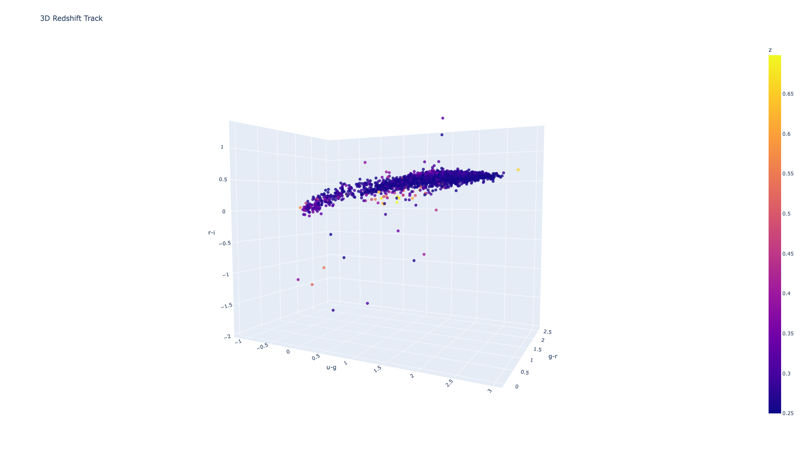
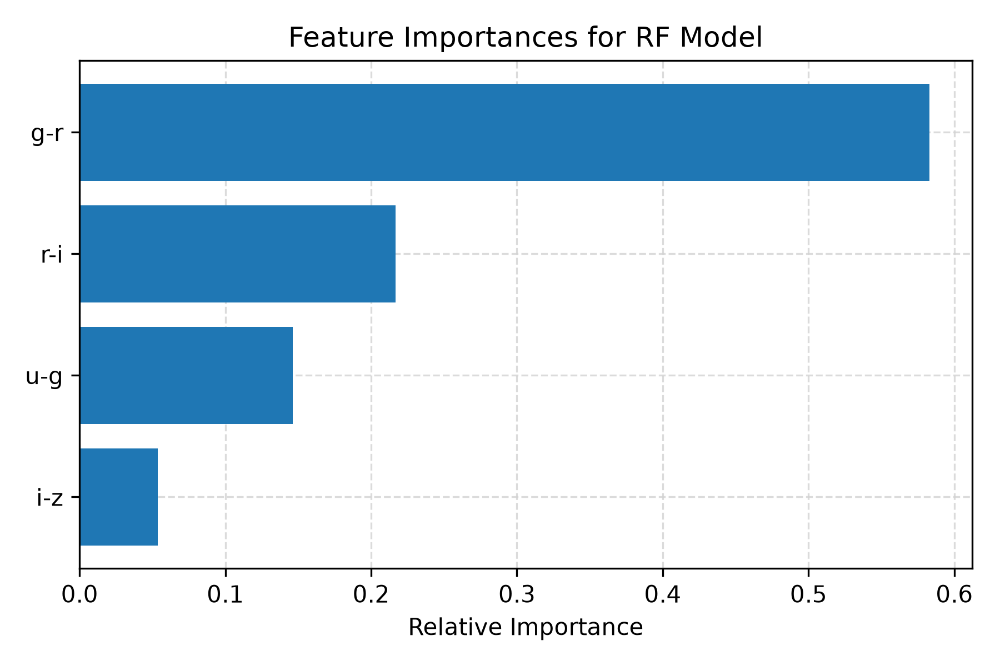
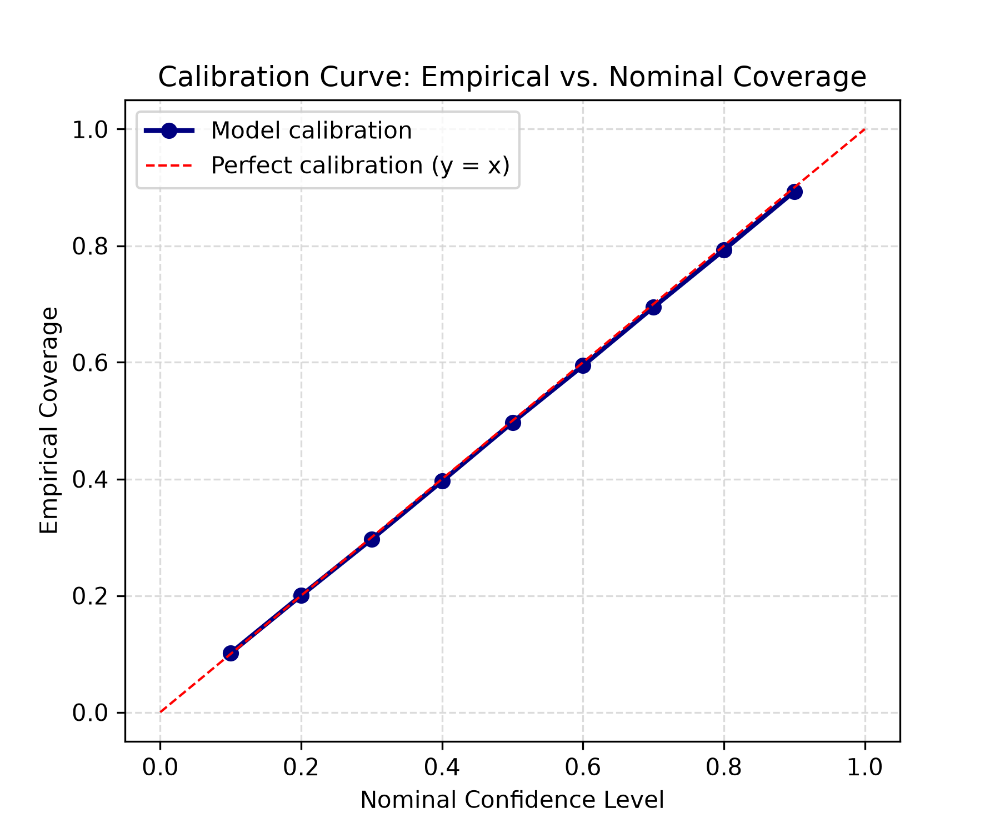
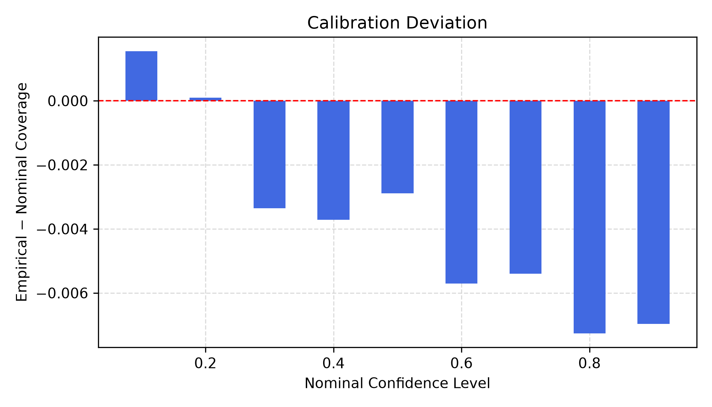

# Photometric Redshift Estimation with Calibrated Uncertainty Quantification

## Motivation

Large-scale astronomical surveys produce broadband photometric measurements for billions of galaxies, but spectroscopic redshifts (the precise, "ground truth" measurement) will only ever be obtained for a small fraction of them, since spectroscopy requires far more telescope time per object than imaging. Photometric redshift (photo-z) estimation addresses this bottleneck by inferring redshift statistically from a galaxy's broadband colors alone. The physical basis for this technique is the following: as a galaxy's redshift increases, the 4000 Å break (a sharp drop in its spectrum caused by metal absorption in older stellar populations) shifts sequentially through the broadband filters used to image it, leaving a detectable fingerprint in the galaxy's colors.

Upcoming large-scale extragalactic surveys, such as the Legacy Survey of Space and Time (LSST), will soon provide observations of billions of galaxies. Processing this unprecedented volume of data requires highly scalable machine learning models. However, relying on deterministic point-estimates is no longer sufficient: cosmological probes of dark matter and dark energy depend on measuring galaxy redshifts for hundreds of millions of objects with well-constrained uncertainties, and photo-z errors propagate directly into the models constraining those cosmological quantities. This is particularly true for weak lensing analyses.

If a model cannot provide well-calibrated confidence intervals, it cannot be reliably used for precision cosmology. To meet this bar, the LSST Science Requirements Document explicitly specifies strict photo-z performance targets on the same normalized residual this project uses throughout (Δz = (z_phot − z_spec) / (1 + z_spec)): an RMS of Δz σ < 0.02, a bias < 0.003, and an outlier fraction < 10% of the total sample. This project specifically aims to tackle these challenges by optimizing both point-estimate accuracy and the statistical calibration of predictive uncertainties.

## Research Questions

1. **Accuracy:** How accurately can standard ML regression methods estimate photometric redshift from SDSS broadband photometry, and how does that accuracy vary systematically with galaxy magnitude, redshift, and color-space location?
2. **Calibration:** Can quantile regression produce photo-z uncertainty estimates that are well-calibrated? Specifically, do stated 68%/90% confidence intervals actually contain the true redshift 68%/90% of the time?

## Objectives

- Build and evaluate a progression of point-estimate models (linear → kNN → random forest/gradient boosting → MLP) on a common, fixed data split and a common, standard metric suite (bias, NMAD, outlier fraction).
- Characterize where each model fails (faint magnitudes, low redshift, degenerate color regions) via binned error analysis, not just aggregate accuracy.
- Implement quantile regression to produce predictive intervals, and test their calibration against nominal confidence levels.
- Connect uncertainty behavior back to physical/observational causes (photometric noise, color-redshift degeneracy) rather than treating it as a black box.

## Working Hypotheses & Outcomes

- **H1: Tree ensembles will outperform linear/kNN baselines on NMAD and outlier fraction.** _Partially confirmed._ All non-linear methods substantially outperform linear regression (~43% NMAD reduction), but the specific choice among non-linear methods (RF, GB, MLP, kNN, quantile regression's median) makes only marginal further difference, as they converge to within a few percent of each other. The real driver of performance is linear vs. non-linear, not which non-linear method is chosen.
- **H2: Predictive interval width will be elevated in the identified degenerate color-space region and at fainter magnitudes.** _Confirmed._ Interval width was meaningfully wider in the degenerate region (see Results), and showed a mild U-shaped relationship with magnitude, elevated at both the faint end (consistent with photometric noise) and the bright end (consistent with the rarity of very bright galaxies in this sample). Interval width was also directly checked against measured photometric error (`modelMagErr_i`), not just magnitude as a proxy for it — see Results.
- **H3: Naive quantile regression, fit independently per quantile, will show at least mild miscalibration out of the box.** _Confirmed._ A small overconfidence pattern was found. Deviation is near-zero (even slightly positive, +0.0015) at the 10% confidence level, then steps down to roughly -0.003 to -0.004 through the 30–50% range, then steps down again to roughly -0.006 to -0.007 through 60–90%, peaking at -0.0072 at the 80% level specifically. This is a two-step pattern rather than a smooth climb, plausibly connected to reduced training density at the extreme quantiles.

## Scope & Non-Goals

- **In scope:** tabular/derived-feature methods (colors + i-band magnitude) on a single survey (SDSS spectroscopic sample), classical ML plus one small neural network, quantile regression for uncertainty.
- **Out of scope:** raw imaging/CNN-based approaches, multi-survey cross-calibration, and new methodological contributions beyond application of established techniques.

## Dataset

- **Source:** SDSS spectroscopic galaxy sample, retrieved via `astroML.datasets.fetch_sdss_specgals()`.
- **Features:** Four adjacent broadband colors computed from SDSS model magnitudes (`u-g`, `g-r`, `r-i`, `i-z`), plus `modelMag_i` and `modelMagErr_i` used in binned error analysis and the uncertainty-vs-physical-cause check.
- **Target:** Spectroscopic redshift (`z`).
- **Cleaning:** Rows were retained only where all five photometric error bands (`modelMagErr_u/g/r/i/z`) were strictly below 1.0, and `z > 0.02`.
    - _Note on `z > 0.02`:_ This cutoff was chosen empirically rather than by convention. Testing several candidate cutoffs (0.1, 0.05, 0.02) revealed that models trained with any fixed lower boundary show elevated bias in the redshift bin immediately above that boundary. This is a regression-to-the-mean edge effect that relocates wherever the cutoff is drawn, rather than being a fixed property of low-redshift objects specifically. Training on the broadest usable range pushes this artifact to the true edge of the data, rather than discarding the ~47% of the raw sample that a stricter `z > 0.1` cut alone would remove.
- **Split:** 70% Train, 15% Validation, 15% Test (fixed `random_state=42`).

## Operational Definitions

|Term|Definition|
|---|---|
|**Δz (normalized residual)**|`(z_pred − z_true) / (1 + z_true)`|
|**Bias**|Mean of Δz over an evaluation set|
|**NMAD**|`1.4826 × median(abs(Δz − median(Δz)))` — a scatter statistic robust to outliers|
|**Outlier fraction**|Fraction of an evaluation set with `abs(Δz) > 0.05`|
|**Empirical coverage**|For a given nominal confidence level, the fraction of objects whose true `z` actually falls inside the model's predicted interval at that level|
|**Degenerate region**|A region of color-color space (`g-r`, `r-i`) where similar colors correspond to a high spread of true redshift, identified via a std(z) heatmap over the full cleaned dataset, independent of any trained model|

## Methods

Six models were trained and compared: five point-estimate regressors, plus quantile regression for uncertainty. Hyperparameters were tuned via `GridSearchCV` (3-fold CV, on a fixed 100,000-row subsample of the training set for tractability), then refit on the full training set with the winning hyperparameters.

|Model|Tuned via|Final hyperparameters|
|---|---|---|
|Linear regression|— (no hyperparameters)|—|
|k-Nearest Neighbors|GridSearchCV|`n_neighbors=50`, `algorithm=kd_tree`, `p=2`, `weights=distance` (with `StandardScaler`)|
|Random Forest|GridSearchCV|`max_depth=15`, `n_estimators=300`, `max_features=2`|
|Gradient Boosting (`HistGradientBoostingRegressor`)|GridSearchCV|`learning_rate=0.1`, `max_iter=200`, `max_depth=20`|
|MLP|GridSearchCV|`hidden_layer_sizes=(128,64)`, `activation=relu`, `alpha=1e-6`, `learning_rate_init=0.001` (with `StandardScaler` on features, `MinMaxScaler` on target)|
|Quantile Regression|— (reused GB's tuned hyperparameters)|Five separate `HistGradientBoostingRegressor` models (`learning_rate=0.1`, `max_iter=200`, `max_depth=20`), each fit with quantile loss at the 5th, 16th, 50th, 84th, and 95th percentiles|

_Design decision:_ Quantile regression was chosen over Gaussian Process (GP) regression for uncertainty quantification. While GPs offer elegant analytical uncertainty, they scale as O(N³) and struggle computationally on datasets beyond ~10⁵ samples without sparse approximations. Tree-based quantile regression is scalable, nonparametric, and fast to evaluate at this sample size.

## Results

### Test Set Metrics Table

|Model|NMAD|Outlier Fraction|Bias|
|---|---|---|---|
|Linear Regression|0.02779|0.08013|+0.00116|
|k-Nearest Neighbors|0.01619|0.02474|+0.00032|
|Random Forest|0.01606|**0.02345**|+0.00043|
|Gradient Boosting|0.01625|0.02381|+0.00044|
|MLP|0.01619|0.02446|-0.00038|
|Quantile Regression (Median)|**0.01580**|0.02618|-0.00096|

No single model wins on every metric. Random Forest has the lowest outlier fraction, while Quantile Regression's median has the lowest NMAD. However, all five non-linear methods sit well separated from linear regression.

**Key finding:** moving from linear to non-linear architectures yields a large improvement (~43% NMAD reduction), but the specific choice of non-linear model yields only marginal further differences. All non-linear methods converge near an NMAD of ~0.016, suggesting an intrinsic informational limit in broadband photometry for this dataset.

### Binned Error Analysis

Binning validation error by redshift and by i-band magnitude, for every model, surfaces two distinct patterns:

- **By redshift:** all models show elevated bias and outlier fraction in the lowest bin (0.02–0.05) and in the sparsest highest bins — but linear regression's tail breakdown is by far the most dramatic. Its outlier fraction climbs from ~3% in the 0.10–0.15 bin to 43% in the 0.25–0.30 bin, while the non-linear models stay in the 3–6% range across the same bin. This is a concrete illustration of why a purely linear model is unsuitable here — it is exactly where the color-redshift relationship curves away from anything a straight line can capture.
- **By magnitude:** unlike interval width (which shows a U-shape, see below), _point-estimate_ error degrades monotonically with fainter magnitude for every non-linear model. For Random Forest, bias moves from +0.011 (brightest quintile) to -0.006 (faintest), NMAD rises from 0.0152 to 0.0190, and outlier fraction nearly doubles from 2.3% to 4.4%. This is an expected pattern (fainter objects carry noisier photometry) and holds across RF, GB, and MLP alike.

### Calibration

Empirical coverage was measured at 10 confidence levels from 10% to 90%. At the two headline levels, the 68% interval achieved 67.48% empirical coverage and the 90% interval achieved 89.30%, both within about 1 percentage point of nominal. Across the full sweep, deviation was near-zero at low confidence and grew to roughly -0.7 percentage points by 80–90% confidence (see H3): a small overconfidence in the widest intervals. Overall, the model is well-calibrated.

### Key Figures

*Click the image above to view the interactive 3D scatter plot.*

_Figure 1: The 3D Redshift track through `u-g`, `g-r`, and `r-i` space, illustrating the highly non-linear manifold that necessitates advanced machine learning models._

 

_Figure 2: Random Forest Feature Importance. `g-r` heavily dominates the predictive splits, largely due to the 4000 Å break traversing this filter combination for the bulk of our sample._

 

_Figure 3: Empirical Coverage vs. Nominal Confidence Level. Evaluating the quantile regression model reveals how closely our predicted intervals match real-world variance._

### Degenerate Color-Space Region

Within the validation set, a specific region of color-color space was identified where similar colors map to a wide array of physical redshifts (**g-r ∈ [0.4, 0.75], r-i ∈ [0.15, 0.35]**), found via a std(z) heatmap using no model at all. Within this subset, point-estimate NMAD degraded to 0.0202 (vs. 0.0157 for the rest of the sample) and outlier fraction rose to 0.0383 (vs. 0.0230) — quantitatively demonstrating a physically-grounded limit to photo-z precision within this specific color boundary.

This region's effect extends to uncertainty as well: predictive interval width was directly checked against redshift, i-band magnitude, and the galaxy's actual measured photometric error (`modelMagErr_i`). Interval width was meaningfully wider inside the degenerate region than outside it, and tracked measured photometric error directly.

## Limitations

- **Quantile crossings:** In a small percentage of galaxies, predicted lower percentiles incorrectly exceeded upper percentiles. This is a known limitation of fitting quantile models independently rather than jointly. It is addressed via sorting prior to interval construction.
- **Selection effects (Malmquist bias):** the SDSS spectroscopic sample is not a uniform draw of the galaxy population. Because it is a flux-limited survey, it disproportionately represents intrinsically brighter, more massive galaxies at higher redshifts, potentially biasing the model against faint, low-mass populations.
- **Single-survey scope:** this pipeline was trained, validated, and tested entirely on SDSS photometry. Filter responses and depth characteristics vary substantially between observatories, so this trained model cannot be generalized "out-of-the-box" to multi-survey datasets without transfer learning or domain adaptation.

## What I'd Try Next

- **Gaussian Process Regression:** implementing a sparse GP (e.g., via inducing points) as described in Ivezić et al. (§8.10), to natively output calibrated analytical posteriors on a sub-sample of the data.
- **Deep learning on imagery:** moving beyond tabular pre-computed fluxes to CNNs applied directly to raw astronomical imaging, extracting visual features that correlate with redshift.
- **Extending to higher redshifts:** applying these techniques to deeper surveys (e.g., HSC, COSMOS) to test algorithmic stability and uncertainty calibration as signal-to-noise drops sharply at z > 1.0.

## References

- Salvato, M., Ilbert, O., & Hoyle, B. (2019). The many flavours of photometric redshifts. _Nature Astronomy_, 3, 212–222. [arXiv:1805.12574](https://arxiv.org/abs/1805.12574)
- Jones, E., Do, T., Boscoe, B., Singal, J., Wan, Y., & Nguyen, Z. (2024). Improving Photometric Redshift Estimation for Cosmology with LSST using Bayesian Neural Networks. [arXiv:2306.13179](https://arxiv.org/abs/2306.13179)
- Ivezić, Ž. et al. _Statistics, Data Mining, and Machine Learning in Astronomy_ (Updated Edition). §9.7 (photo-z via random forests), §8.10 (Gaussian Process Regression).
- LSST Science Requirements Document. Photo-z performance benchmarks on Δz = (z_phot − z_spec)/(1 + z_spec): RMS(Δz) < 0.02, bias < 0.003, outlier fraction < 10%. [arXiv:1708.04058](https://arxiv.org/pdf/1708.04058)
- Buchner, J. & Fotopoulou, S. (2024). How to set up your first machine learning project in astronomy. _Nature Reviews Physics_, 6(9), 535–545. [DOI:10.1038/s42254-024-00743-y](https://doi.org/10.1038/s42254-024-00743-y)